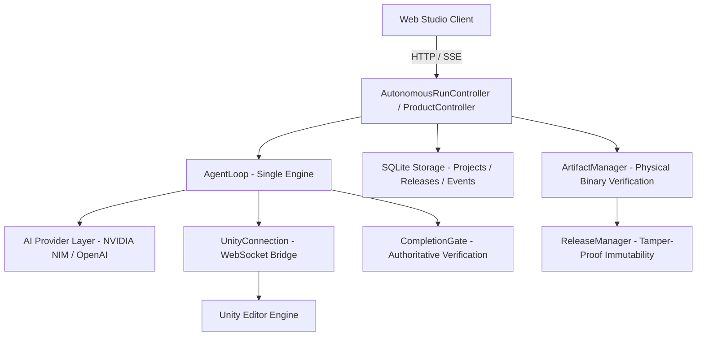

# Architecture Guide — Autonomous Game Studio

## 1. Overview & Architectural Invariants

The Autonomous Game Studio is an enterprise-grade autonomous game development platform enabling end-to-end game creation from natural language descriptions. The system enforces strict architectural invariants:

```text
Natural-Language Game Idea
           ↓
Autonomous Game Studio
           ↓
Build (AgentLoop + Unity Tools)
           ↓
Compile (Unity Roslyn Compiler)
           ↓
Repair (Diagnostic Feedback Loop)
           ↓
Play/Test (Simulated & Real Play Mode)
           ↓
Validate (Behavioral Assertions)
           ↓
Package (ArtifactManager + SHA-256)
           ↓
Release Candidate (Human Review Gate)
           ↓
Deploy & Publish
```

### Invariant 1: Single Agent Execution Engine
`AgentLoop` is the **sole** LLM tool-calling and autonomous execution engine. No secondary agent loop, background autonomous planner, or parallel execution thread is permitted to bypass `AgentLoop`. All tool invocations and state transitions pass through `AgentLoop`.

### Invariant 2: Coordinator Separation
`AutonomousRunController` coordinates long-running autonomy workflows (sessions, lifecycle state, SSE streaming, error propagation). It **delegates** all tool execution to `AgentLoop` and does not duplicate reasoning logic.

### Invariant 3: Authoritative CompletionGate
`CompletionGate` is the authoritative tribunal governing step completion and run finalization. An LLM cannot self-declare completion; a run is only marked complete when:
- Unity compilation succeeds with zero errors.
- Hierarchy matches the required game specification.
- Component and script requirements are verified.
- Play Mode runtime assertions pass.

### Invariant 4: Unity Engine Authority
Unity remains authoritative for scenes, GameObjects, scripts, components, compilation, and runtime execution. The backend does not emulate Unity physics or script compilation; it drives the real or simulated Unity engine via the bidirectional WebSocket bridge.

### Invariant 5: Zero-Secret Invariant
Plaintext credentials, API keys, and bearer tokens are strictly forbidden from being stored in:
- SQLite databases
- Git repositories
- Export archives (.unitypackage, .zip)
- Client-facing API responses (masked only)
- Application logs or diagnostics bundles
- Generated C# scripts or Unity assets

---

## 2. Core Subsystems



### Subsystems Breakdown:
1. **AI Provider Layer**: Manages streaming and non-streaming inference across OpenAI-compatible endpoints (NVIDIA NIM, OpenAI, Ollama, vLLM) with automatic retry, jittered exponential backoff, and circuit breaker protection.
2. **Unity Bridge**: Bidirectional WebSocket connection (`/ws/unity`) handling commands (`execute_script`, `create_gameobject`, `inspect_scene`, `compile_scripts`, `play_mode`).
3. **Completion Gate**: Multi-stage verification engine evaluating compilation, structural integrity, and behavioral tests.
4. **Release Manager & Artifact Manager**: Cryptographically verified build artifact management with SHA-256 fingerprinting, byte-tamper detection, and immutable publishing states.
5. **Security Audit & Validator**: Deep scanning engine verifying Zero-Secret compliance and C# AST safety.
